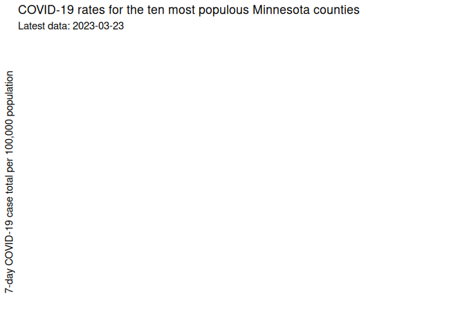

# Minnesota COVID Reports


Report last run: 2025-03-03 05:51:05

## Introduction

This is an example report that uses COVID-19 data from the New York
Times to illustrate the use of automation processes.

First, we load some necessary libraries, define some key variables, then
read in the data:

``` r
library(dplyr)
library(ggplot2)
library(readr)
library(lubridate)
library(forcats)
library(knitr)

LAG_DAYS <- 7
POP_DENOM <- 100000

## County populations (read from a local data file in this repo)
pops <- read_csv("countypop_us.csv")

## COVID-19 case counts from the NYTimes (read from the web; updated daily)
county_data <- read_csv("https://raw.githubusercontent.com/nytimes/covid-19-data/master/us-counties-2023.csv")

rate_data <- county_data %>%
  select(date, state, county, cases) %>%
  mutate(date = ymd(date)) %>%
  left_join(pops, by = c("state", "county")) %>%
  group_by(state, county) %>%
  mutate(cases_lag = lag(cases, LAG_DAYS),
         totalcases_last = cases - cases_lag) %>%
  ungroup() %>%
  mutate(rate_last = totalcases_last / pop * POP_DENOM)
```

### Minnesota

Here is a plot of COVID-19 rates since Jan. 1, 2023 in the 10 most
populous Minnesota counties:

``` r
## Identify the top 10 most populous counties
top10_pop <- pops %>% filter(state == "Minnesota") %>%
  arrange(desc(pop)) %>%
  slice(1:10) %>%
  mutate(county = factor(county))

## Make the plot
rate_data %>%
    filter(state == "Minnesota", 
         county %in% top10_pop$county,
         date > Sys.Date() - 30) %>%
  ggplot(aes(x = date, y = rate_last, color = county)) +
  geom_line(linewidth = 2) +
  xlab(NULL) +
  ylab("7-day COVID-19 case total per 100,000 population") +
  scale_color_discrete(name = "") +
  theme_minimal() +
  ggtitle("COVID-19 rates for the ten most populous Minnesota counties", 
          subtitle = paste("Latest data:", max(rate_data$date)))
```



### United States

The following plot shows the distribution of current COVID-19 rates by
county for each state in the United States. The x-axis is truncated at a
7-day rate of 500 per 100,000 people for improved readability.

``` r
rate_data %>%
  filter(date == max(date),
         !is.na(rate_last)) %>%
  mutate(state = fct_reorder(factor(state), -rate_last, median, na.rm = TRUE)) %>%
  ggplot(aes(x = rate_last, y = state)) +
  geom_boxplot() +
  xlim(c(10,700)) +
  xlab("7-day COVID-19 total cases per 100,000 people") +
  ylab(NULL) +
  ggtitle("Distribution of county-level COVID-19 case rates, by state",
          subtitle = paste("Latest data:", max(rate_data$date)))
```


Here is a table of the 20 counties with the highest 7-day per 100,000
COVID-19 case rates:

``` r
rate_data %>%
  filter(date == max(date),
         !is.na(rate_last)) %>%
  arrange(desc(rate_last)) %>%
  select(county, state, pop, rate_last) %>%
  rename(covid_rate = rate_last) %>%
  mutate(covid_rate = round(covid_rate)) %>%
  slice(1:20) %>%
  knitr::kable()
```

| county                   | state         |   pop | covid_rate |
|:-------------------------|:--------------|------:|-----------:|
| Major                    | Oklahoma      |  7629 |      10067 |
| McIntosh                 | Oklahoma      | 19596 |       4241 |
| Hansford                 | Texas         |  5399 |        704 |
| Cimarron                 | Oklahoma      |  2137 |        702 |
| Latimer                  | Oklahoma      | 10073 |        536 |
| Harmon                   | Oklahoma      |  2653 |        528 |
| Pecos                    | Texas         | 15823 |        487 |
| Douglas                  | South Dakota  |  2921 |        479 |
| Yoakum                   | Texas         |  8713 |        448 |
| Haskell                  | Oklahoma      | 12627 |        443 |
| Northwest Arctic Borough | Alaska        |  7621 |        420 |
| Dewey                    | South Dakota  |  5892 |        390 |
| Menifee                  | Kentucky      |  6489 |        385 |
| Hyde                     | South Dakota  |  1301 |        384 |
| Barnes                   | North Dakota  | 10415 |        384 |
| Wirt                     | West Virginia |  5821 |        378 |
| St. Croix                | Wisconsin     | 90687 |        371 |
| Thurston                 | Nebraska      |  7224 |        360 |
| Bethel Census Area       | Alaska        | 18386 |        354 |
| Dewey                    | Oklahoma      |  4891 |        348 |
